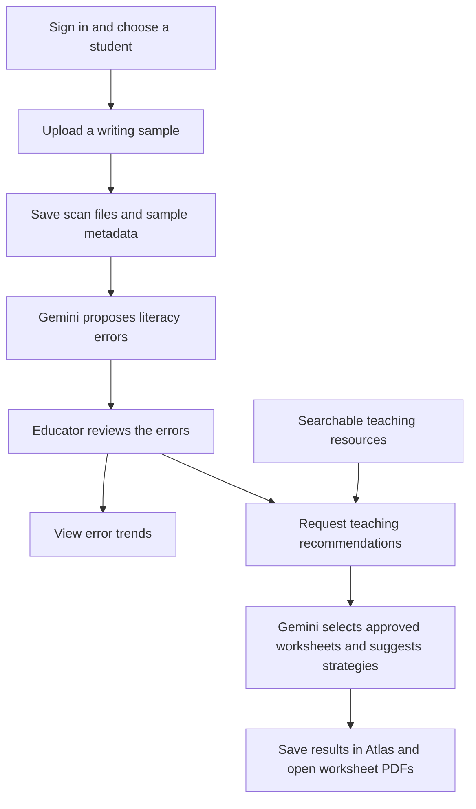
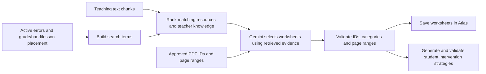

# LexiPath: using the app, its data, and RAG

The app runs at http://localhost:5173. It now uses **MongoDB Atlas**, **live Gemini**, and the teaching resources from your **Data** folder. Azure is no longer required for the configured recommendation flow. Google Cloud upload is prepared for later; nothing has been uploaded or deployed there.

## Start using it

1. Double-click `Create-Account-LexiPath.cmd` in `C:\Users\somes\Desktop\LexiPath` once. Choose your app username, email and password privately. This login is separate from your Atlas database credentials.
2. Open http://localhost:5173 and sign in.
3. Add a student and open their profile.
4. Upload a fictional JPG, PNG or PDF for the hackathon demo.
5. Review the suggested errors, then view trends or generate worksheets/an intervention report.

Your Atlas database started empty. Changing the database URI did not migrate the old local demo account or students. The launcher now skips automatic demo seeding for remote databases. Use `Restart-LexiPath.cmd` after changing settings.

## The workflow



- **Sign in:** the server checks a bcrypt password hash in Atlas and issues a signed login token. The browser stores the session locally and sends the token with requests.
- **Student:** name and grade are required. Optional programme, band, programme year, term and week help match resources.
- **Upload:** the server checks the actual file format. PDFs become page images. Originals stay on disk; Atlas holds sample metadata and file references.
- **Analysis:** the server processes an analysis copy of each image and sends the images to Gemini. It validates the returned JSON before saving the original written text, intended word, category, confidence, explanation and scan location.
- **Review:** compare suggestions with the scan, change categories, add missed errors, dismiss false positives and mark the review done. Dismissed errors remain recorded but stop contributing to totals. The original written word is preserved.
- **Trends:** calculate totals and category changes directly from saved samples, excluding dismissed errors. Trends are calculated when requested, not stored in a separate collection.
- **Recommendations:** generate up to three worksheet sections for one sample, or up to four intervention strategies across a student's samples. The student report stores the latest version; generating again replaces it.

Sample states are `UPLOADED` → `ANALYSED` → `REVIEWED`, or `FAILED` if analysis cannot finish. The website checks progress every two seconds, for up to three minutes. Stopping that wait does not cancel the server job.

The six error categories are phonological, orthographic, morphological, capitalisation, punctuation and unsure. Current code allows both `ANALYSED` and `REVIEWED` samples in trends and recommendations, so review the suggestions before relying on them.

## Where the data goes

| Data | Location | Contents |
|---|---|---|
| Login accounts | Atlas `accounts` | Username, email, profile, password hash, reset fields |
| Students | Atlas `students` | Name, grade, curriculum placement and teacher ID |
| Writing samples | Atlas `samples` | Student reference, title, task type, file references, status, detected errors, review decisions and worksheet metadata |
| Intervention reports | Atlas `recommendationreports` | One latest report per student, with strategies, evidence and worksheet metadata |
| Uploaded scans | `project/server/samples/<studentId>/` | Image files and source PDFs; image bytes are not in Atlas |
| Original teaching files | `Data/01…`, `Data/02…`, `Data/03…` | Curriculum, lesson materials and teaching library; originals preserved |
| App knowledge package | `Data/06 App Knowledge/` | Searchable Markdown chunks, six approved PDFs and manifests |
| Private settings | `project/server/.env` | Database URI, Gemini configuration, login secret and knowledge-folder path |

One student has many samples and one latest intervention report. Errors live inside each sample. The browser receives protected image/PDF endpoints, not raw filesystem paths or cloud credentials.

The retest created fictional records temporarily and removed all of them. After cleanup, Atlas had **0 accounts, 0 students, 0 samples and 0 reports**. Create your own app account to start.

## How the RAG system works

RAG means **retrieval-augmented generation**: search the teaching resources first, then give relevant material to Gemini to help produce a grounded recommendation.



1. **Prepare the knowledge:** extract text from the curriculum, weekly lessons and teaching library. PDF, Word, PowerPoint and spreadsheet text becomes bounded Markdown chunks. Student submissions and organisation records are excluded.
2. **Build search terms:** use non-dismissed errors, their written/intended words and notes, category aliases, and grade level. Curriculum placement helps filter and rank matches. Recommendation context does not include the student's name or account details.
3. **Retrieve:** read the manifest-listed chunks from `KNOWLEDGE_ROOT`. Rank by keyword matches and curriculum compatibility. Select resource and teacher-knowledge evidence, bounded to 48,000 characters by default. The server caches the corpus until restart.
4. **Generate worksheets:** give Gemini the retrieved evidence and the fixed catalogue of approved PDF sections. It selects up to three worksheets and explains the choice.
5. **Validate:** reject invented worksheet IDs/page ranges and unsupported categories. Only approved two-to-three-page sections can be saved.
6. **Generate a student report:** select worksheets first, then make a second Gemini request using the errors and selected worksheets. Validate evidence references and save up to four strategies as the student's latest report.
7. **Open a PDF:** the backend reads the approved PDF and serves it through an authenticated endpoint. Recommended page ranges are shown as metadata; the endpoint serves the full PDF rather than extracting only those pages.

This is **keyword and metadata retrieval**, with no embedding pipeline or Atlas Vector Search. Atlas stores app records and generated results; the teaching corpus is stored separately. The app does not train or fine-tune Gemini on the documents.

## What was indexed

- 453 source teaching files inspected across the three teaching folders.
- 449 files yielded readable text, producing **895 Markdown chunks**.
- Six original PDFs match the existing approved catalogue by SHA-256, and all six page ranges fit their PDFs.
- The generated package is about **27.4 MB**.
- Three source files have no extractable text, and one PDF is locked. Image-only content, including 154 PDF pages without extractable text, still needs OCR or manual transcription. This is text extraction, not an OCR-complete copy of every page.

`Data/06 App Knowledge/_manifests/build-report.json` records extraction coverage. The original files were not changed. After adding teaching material to folders 01, 02 or 03, double-click `Rebuild-Knowledge-LexiPath.cmd`. It rebuilds the package and restarts the app. New downloadable worksheet sections still need human-approved entries in the section catalogue.

## The environment settings that matter now

Keep your existing private `MONGODB_URI`, `GEMINI_API_KEY` and `JWT_SECRET` in `project/server/.env`. The URI explicitly selects Atlas's existing `/LexiPath` database, with that capitalization.

```dotenv
USE_MOCK_AI=false
GEMINI_MODEL_NAME=gemini-3.1-flash-lite
RECOMMENDATION_USE_MOCKS=false
KNOWLEDGE_STORAGE_PROVIDER=mounted
KNOWLEDGE_ROOT=../../Data/06 App Knowledge
WORKSHEET_SECTIONS_PATH=../../Data/06 App Knowledge/_manifests/worksheet-sections.json
```

These are already configured. `mounted` means “read a resource folder”; it works with the local folder now and a mounted Google Cloud Storage bucket later. Existing Azure values are unused in this mode. No Azure account or SAS token is needed.

The Desktop backend uses the installed Node 22 runtime because it successfully resolves Atlas on this laptop; the frontend keeps bundled Node 24. No laptop DNS settings were changed. The previous Gemini alias returned high-demand errors, so the selected model is the one that passed real image analysis.

## Verified on 2 October 2026

**Live app:** Atlas connection, login, student creation, protected scan access, upload → Gemini → saved analysis, dismissal/restoration/reclassification, review completion, trends, grounded worksheet generation, PDF download, student report generation and latest-report retrieval all passed.

These live checks used fictional data. They verify integration and storage, not handwriting recognition accuracy or intervention effectiveness.

**Automated checks:** 390 server tests passed, one optional live-suite test skipped; all 48 client tests passed; all 28 focused recommendation/storage tests passed; frontend production build and launcher checks passed. Server lint passed. Client lint completed with one existing account-page dependency warning. Updated the stale polling test to verify the current three-minute waiting limit.

## Google Cloud later

The prepared layout is Cloud Run for the app, Atlas for app records, a private Cloud Storage scan bucket, and a separate private teaching-knowledge bucket. Cloud Run mounts the knowledge bucket read-only at `/app/knowledge`; the same reader then accesses its files. Its service account gets read-only knowledge access, so the app needs no storage API key or public resource URLs.

After installing the Google Cloud CLI and choosing a project, run these from `project`:

```powershell
.\scripts\setup-gcp.ps1 -ProjectId your-project-id
# Add the four Secret Manager values and allow the printed outbound IP in Atlas.
.\scripts\upload-knowledge.ps1 -ProjectId your-project-id
.\scripts\deploy-gcp.ps1 -ProjectId your-project-id
```

The upload script validates and uploads only `Data/06 App Knowledge`, rather than the entire Data folder. The deployment checks the knowledge manifests before starting. Cloud execution has not been tested or performed; the CLI/container tooling is not installed here.

Existing laptop scan files and Windows paths need migration if the cloud app must open those old samples. Atlas shares metadata, but does not transfer image files. New cloud uploads use the prepared scan-bucket mount.

For a shared deployment, the current app still has no per-teacher data separation or recovery of background analysis after a server restart. Use fictional data for the hackathon demo until those limits are addressed.

## Code map

- `client/src/pages/`: website screens.
- `server/models/`: account, student, sample and report data shapes.
- `server/controllers/`: uploads, review, trends and recommendations.
- `server/services/errorClassificationEngine.js`: image analysis.
- `server/services/recommendationEngine.js`: storage readers, retrieval, Gemini generation and validation.
- `scripts/build-knowledge.py`: rebuild the teaching package; needs Python and `pypdf`.
- `scripts/upload-knowledge.ps1`: upload the validated package later.
- `deploy/cloud-run.env.yaml`: cloud runtime settings.

References: [Google Cloud's storage-mount documentation](https://docs.cloud.google.com/run/docs/configuring/services/cloud-storage-volume-mounts), [Gemini 3.1 Flash-Lite](https://ai.google.dev/gemini-api/docs/models/gemini-3.1-flash-lite), and [MongoDB connection troubleshooting](https://www.mongodb.com/docs/atlas/troubleshoot-connection/).
